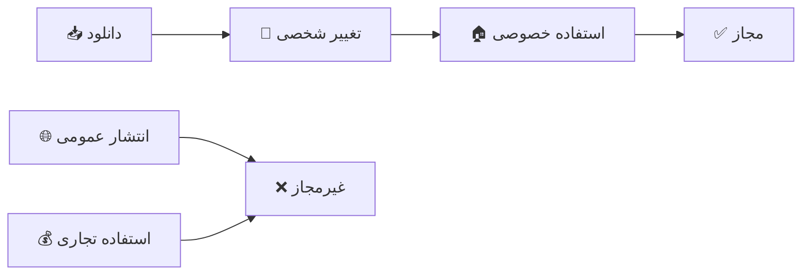
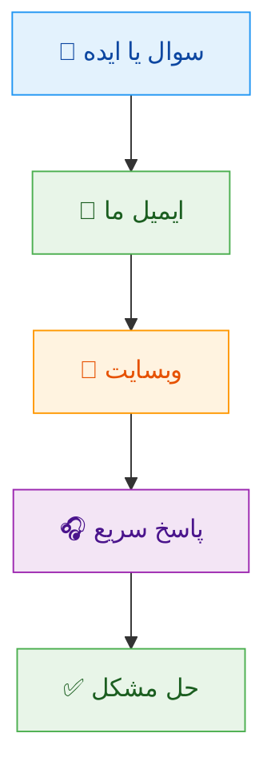
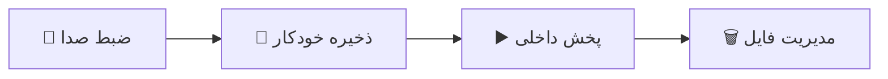
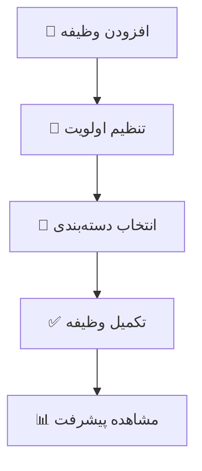
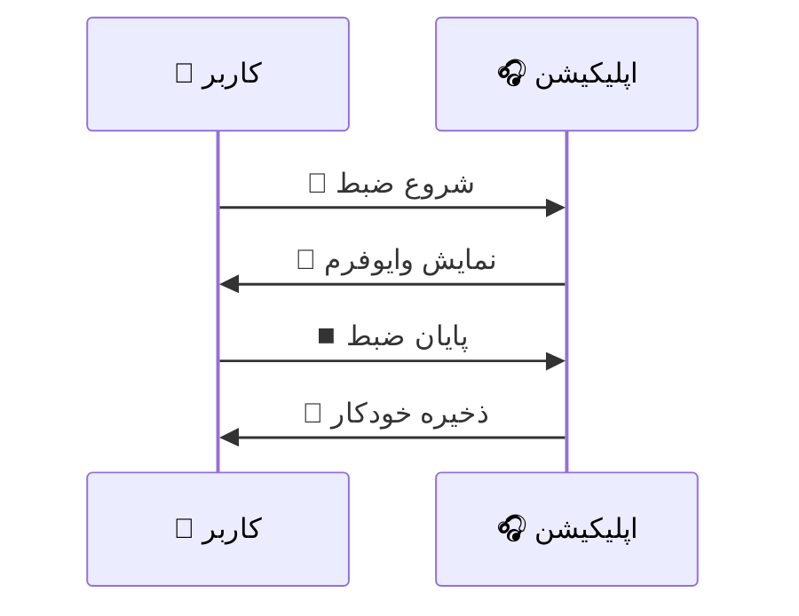
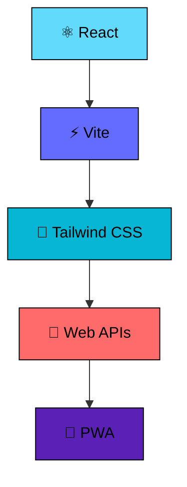
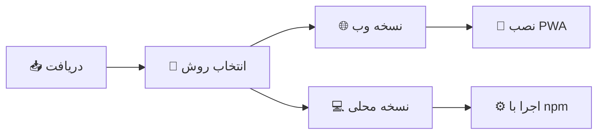
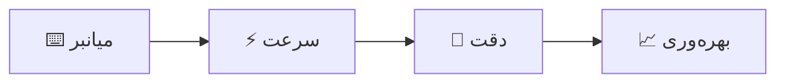
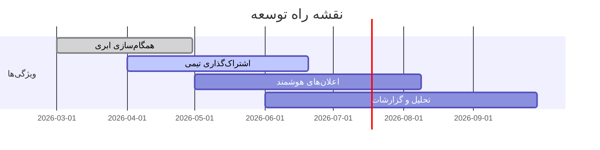

<div align="center">

# 🎯 TaskFlow Pro
## 📋 مدیریت پیشرفته کارها و وایت‌بورد دیجیتال

[](./LICENSE.md)
[](./CHANGELOG.md)
[]()
[]()

---

</div>

<p align="center">
  
</p>

---

<div align="center">

<p><strong>TaskFlow Pro</strong> یک اپلیکیشن قدرتمند برای مدیریت وظایف و سازماندهی افکار شماست. با ترکیب هوشمندانه‌ی مدیریت کارها و وایت‌بورد دیجیتال، تجربه‌ای بی‌نظیر از بهره‌وری را ارائه می‌دهد.</p>
<h1>برای استفاده ریپازتوری را کلون کنید و فایل index.html را اجرا کنید.</h1>

</div>

---

## 📜 مجوز استفاده و حقوق قانونی

<div align="center">

<p><em>احترام به حق مالکیت معنوی</em></p>

</div>

<div align="center">



</div>

### ✅ موارد مجاز

<div align="center">

<table>
  <tr>
    <th align="center">🎯 عمل</th>
    <th align="center">✅ مجاز</th>
    <th align="center">📝 توضیحات</th>
  </tr>
  <tr>
    <td align="center">📥 دانلود</td>
    <td align="center">✅</td>
    <td align="center">برای استفاده شخصی</td>
  </tr>
  <tr>
    <td align="center">🔧 تغییر کد</td>
    <td align="center">✅</td>
    <td align="center">سفارشی‌سازی برای نیاز شخصی</td>
  </tr>
  <tr>
    <td align="center">🎓 استفاده آموزشی</td>
    <td align="center">✅</td>
    <td align="center">برای یادگیری و تحقیق</td>
  </tr>
  <tr>
    <td align="center">🏠 نصب خصوصی</td>
    <td align="center">✅</td>
    <td align="center">روی دستگاه‌های شخصی</td>
  </tr>
</table>

</div>

### ❌ موارد غیرمجاز

<div align="center">

<table>
  <tr>
    <th align="center">⚠️ عمل</th>
    <th align="center">❌ غیرمجاز</th>
    <th align="center">📜 دلیل</th>
  </tr>
  <tr>
    <td align="center">🌐 ریپازیتوری عمومی</td>
    <td align="center">❌</td>
    <td align="center">محافظت از حق مالکیت</td>
  </tr>
  <tr>
    <td align="center">📤 توزیع عمومی</td>
    <td align="center">❌</td>
    <td align="center">عدم انتشار نسخه‌های تغییر یافته</td>
  </tr>
  <tr>
    <td align="center">💰 استفاده تجاری</td>
    <td align="center">❌</td>
    <td align="center">نیاز به مجوز جداگانه</td>
  </tr>
  <tr>
    <td align="center">🏷️ حذف کپی‌رایت</td>
    <td align="center">❌</td>
    <td align="center">حفظ اعتبار سازنده</td>
  </tr>
</table>

</div>

---

## 🎨 شخصی‌سازی و سفارشی‌سازی

<div align="center">

<p><em>TaskFlow Pro را مطابق سلیقه خود تغییر دهید!</em></p>

</div>

### 🛠️ تغییرات مجاز

<div align="center">

```bash
# تغییرات ظاهری
🎨 پالت رنگی دلخواه
📱 واچ‌فیس شخصی
⚡ انیمیشن‌های سفارشی
🔤 فونت‌های متفاوت

# تغییرات عملکردی
➕ افزودن ویژگی‌های شخصی
🔄 تغییر فرآیندهای کاری
🔌 یکپارچه‌سازی با ابزارها
📊 گزارش‌گیری سفارشی
```

</div>

### 📋 نمونه‌های شخصی‌سازی

<details>
<summary>🎨 تغییر پالت رنگی</summary>

```css
/* تغییر رنگ تم */
.taskflow-pro {
  --primary: #your-color;
  --secondary: #your-accent;
  --background: #your-bg;
}
```

</details>

<details>
<summary>🔧 افزودن ویژگی جدید</summary>

```javascript
// افزودن منوی شخصی
const customFeatures = {
  darkModeToggle: true,
  customSounds: true,
  personalWorkflows: true
};
```

</details>

---

## 📬 تماس و ارتباط

<div align="center">

<p><em>سوال دارید؟ خوشحال می‌شویم کمک کنیم!</em></p>

</div>

<div align="center">



</div>

### 📞 اطلاعات تماس

<div align="center">

<table>
  <tr>
    <td align="center">
      <h3>📧 ایمیل</h3>
      <p><a href="mailto:cyan.diamond.studio@gmail.com">cyan.diamond.studio@gmail.com</a></p>
    </td>
    <td align="center">
      <h3>🌐 وبسایت</h3>
      <p><a href="https://cyandiamondstudio.github.io/website/">cyan.diamond.studio</a></p>
    </td>
    <td align="center">
      <h3>💎 استودیو</h3>
      <p>Cyan Diamond Studio</p>
    </td>
  </tr>
</table>

</div>

### 🚀 حمایت از ما

<div align="center">

<p><em>حمایت شما , انگیزه ما برای توسعه بیشتر است!</em></p>

```bash
# راه‌های حمایت
⭐ ستاره دادن به ریپازیتوری
🔄 به اشتراک گذاری با دوستان
📝 بازخورد و ایده‌های سازنده
🎨 مشارکت در توسعه (با مجوز)
```
<a href="https://www.coffeebede.com/shayan_hajibagher"></a>
</div>

---

<div align="center">

# 🎉 از همراهی شما متشکریم!

<p><strong>TaskFlow Pro</strong> با ❤️ و 💎 توسط تیم <strong>Cyan Diamond Studio</strong> ساخته شده است.</p>

<p><em>ایده دارید؟ 🤔</em> | <em>باگ پیدا کردید؟ 🐛</em> | <em>پیشنهاد دارید؟ 💡</em> | <em>با ما در میان بگذارید!</em></p>

<p>Made with 💎 by <a href="https://cyandiamondstudio.github.io/website/">Cyan Diamond Studio</a></p>

</div>

---

## ✨ ویژگی‌های کلیدی

<div align="center">

### 🚀 مدیریت وظایف هوشمند

<table>
  <tr>
    <td width="50%">
      <details>
        <summary>📝 ایجاد و ویرایش پیشرفته</summary>
        <ul>
          <li>✍️ افزودن وظایف با عنوان و توضیحات کامل</li>
          <li>🎨 دسته‌بندی هوشمند کارها</li>
          <li>⭐ سیستم اولویت‌بندی سه سطحی</li>
          <li>🔄 ویرایش سریع و آسان</li>
        </ul>
      </details>
    </td>
    <td width="50%">
      <details>
        <summary>🔍 جستجو و فیلتر قدرتمند</summary>
        <ul>
          <li>🔎 جستجوی هوشمند در محتوا</li>
          <li>🎯 فیلتر بر اساس وضعیت و دسته</li>
          <li>📊 مرتب‌سازی هوشمند</li>
          <li>⚡ دسترسی سریع به وظایف</li>
        </ul>
      </details>
    </td>
  </tr>
</table>

### 🎨 وایت‌بورد دیجیتال تعاملی

<p align="center">
  
</p>

<table>
  <tr>
    <td width="33%" align="center">
      <h4>🔗 اتصالات هوشمند</h4>
      <p>ایجاد روابط بصری بین نوت‌ها</p>
    </td>
    <td width="33%" align="center">
      <h4>🎨 رنگ‌بندی جذاب</h4>
      <p>۷ رنگ برای دسته‌بندی آسان</p>
    </td>
    <td width="33%" align="center">
      <h4>🔍 زوم و پن</h4>
      <p>کنترل کامل بر فضای کاری</p>
    </td>
  </tr>
</table>

### 🎙️ قابلیت‌های صوتی پیشرفته

<div align="center">



</div>

### 📱 تجربه کاربری استثنایی

<p align="center">
  
  
  
</p>

<table>
  <tr>
    <th align="center">🎨 طراحی</th>
    <th align="center">📱 پشتیبانی</th>
    <th align="center">⚡ عملکرد</th>
  </tr>
  <tr>
    <td align="center">رابط کاربری مدرن</td>
    <td align="center">واکنش‌گرای کامل</td>
    <td align="center">سرعت بالا</td>
  </tr>
  <tr>
    <td align="center">حالت تاریک زیبا</td>
    <td align="center">پشتیبانی RTL</td>
    <td align="center">PWA آفلاین</td>
  </tr>
</table>

</div>

---

## 🚀 شروع سریع

<div align="center">

<p><em>در چند دقیقه با TaskFlow Pro حرفه‌ای شوید!</em></p>

</div>

### 📋 راهنمای مدیریت وظایف



<div align="center">

| مرحله | اقدام | نتیجه |
|-------|-------|-------|
| ۱️⃣ | 🖱️ کلیک روی "افزودن وظیفه" | ایجاد وظیفه جدید |
| ۲️⃣ | ✍️ وارد کردن عنوان و توضیحات | تعریف کامل وظیفه |
| ۳️⃣ | 🎨 انتخاب دسته‌بندی و اولویت | سازماندهی هوشمند |
| ۴️⃣ | ✅ تیک زدن وظیفه |标记完成 |

</div>

### 🎨 راهنمای وایت‌بورد

<div align="center">

```bash
# میانبرهای کلیدی
Ctrl + Scroll    # 🔍 زوم در وایت‌بورد
Alt + Drag       # ✋ جابجابی صفحه
Right Click      # 🚫 غیرفعال (محافظت شده)
Left Drag        # 📝 جابجایی نوت‌ها
```

</div>

<details>
<summary>🎯 نکات حرفه‌ای وایت‌بورد</summary>

- **اتصال نوت‌ها**: از دایره چپ به دایره راست بکشید
- **تغییر اندازه**: از گوشه پایین سمت راست نوت‌ها استفاده کنید
- **حذف اتصال**: روی خط اتصال کلیک کرده و دکمه حذف را بزنید
- **تغییر رنگ**: از پالت رنگی بالای هر نوت استفاده کنید

</details>

### 🎙️ کار با یادداشت‌های صوتی

<p align="center">
  
</p>

<div align="center">



</div>

---

## 🛠️ تکنولوژی‌ها و معماری

<div align="center">

<p><em>ساخته شده با بهترین تکنولوژی‌های روز دنیا</em></p>

</div>

<div align="center">



</div>

### 🏗️ معماری فنی

<p align="center">
  
</p>

<table>
  <tr>
    <th align="center">🔧 تکنولوژی</th>
    <th align="center">📝 کاربرد</th>
    <th align="center">🚀 مزیت</th>
  </tr>
  <tr>
    <td align="center">⚛️ React 18</td>
    <td align="center">رابط کاربری</td>
    <td align="center">مولفه‌محوری و سرعت</td>
  </tr>
  <tr>
    <td align="center">⚡ Vite</td>
    <td align="center">ابزار بیلد</td>
    <td align="center">سرعت توسعه فوق‌العاده</td>
  </tr>
  <tr>
    <td align="center">🎨 Tailwind</td>
    <td align="center">استایل‌دهی</td>
    <td align="center">طراحی مدرن و واکنش‌گرا</td>
  </tr>
  <tr>
    <td align="center">🎤 Web Speech</td>
    <td align="center">ضبط صدا</td>
    <td align="center">بدون نیاز به کتابخانه خارجی</td>
  </tr>
  <tr>
    <td align="center">📱 PWA</td>
    <td align="center">نصب و آفلاین</td>
    <td align="center">تجربه اپلیکیشن نیتیو</td>
  </tr>
</table>

---

## 📱 نصب و راه‌اندازی

### 🚀 روش‌های نصب

<div align="center">



</div>

### 🌐 نصب به عنوان اپلیکیشن

<div align="center">

```bash
# ۱. مرورگر خود را باز کنید
# ۲. به وب‌سایت TaskFlow Pro بروید
# ۳. روی آیکون 📱 (Install) کلیک کنید
# ۴. اپلیکیشن روی دستگاه شما نصب می‌شود
```

</div>

<details>
<summary>💻 اجرای نسخه توسعه (برای توسعه‌دهندگان)</summary>

```bash
# کلون کردن ریپازیتوری
git clone https://github.com/cyandiamondstudio/taskflow-pro.git

# ورود به پوشه پروژه
cd taskflow-pro

# نصب وابستگی‌ها
npm install

# اجرای نسخه توسعه
npm run dev
# 🌐 اپلیکیشن در http://localhost:5173 در دسترس است

# ساخت نسخه نهایی
npm run build

# پیش‌نمایش نسخه نهایی
npm run preview
```

</details>

### 🔧 پیکربندی پیشرفته

<div align="center">

```json
{
  "features": {
    "offline_support": true,
    "voice_recording": true,
    "whiteboard_canvas": true,
    "rtl_support": true,
    "dark_mode": true
  },
  "compatibility": {
    "browsers": ["Chrome 80+", "Firefox 75+", "Safari 13+"],
    "mobile": true,
    "tablet": true,
    "desktop": true
  }
}
```

</div>

---

## ⌨️ میانبرهای کیبورد و نکات حرفه‌ای

<div align="center">

<p><em>در کمترین زمان، بیشترین کارایی را داشته باشید!</em></p>

</div>

### 🎹 میانبرهای اصلی

| میانبر | عملکرد | دسته |
|--------|--------|-------|
| `Ctrl + Scroll` | 🔍 زوم در وایت‌بورد | وایت‌بورد |
| `Alt + Drag` | ✋ جابجایی صفحه | وایت‌بورد |
| `Ctrl + Z` | ↩️ بازگشت عملیات | عمومی |
| `Ctrl + S` | 💾 ذخیره خودکار | وظایف |
| `Enter` | ✅ تایید و اضافه کردن | وظایف |
| `Escape` | ❌ خروج از مد ویرایش | عمومی |

<div align="center">



</div>

### 📂 ساختار پروژه

<details>
<summary>📁 ساختار فایل‌ها و پوشه‌ها</summary>

```
taskflow-pro/
├── 📄 index.html          # ورودی اصلی اپلیکیشن
├── ⚙️ manifest.json       # تنظیمات PWA
├── 🔧 sw.js              # سرویس ورکر آفلاین
├── 🎨 icon.svg           # آیکون اصلی اپلیکیشن
├── 📜 LICENSE.md         # مجوز استفاده شخصی
├── 📖 README.md          # مستندات اصلی
├── 📝 CHANGELOG.md       # تاریخچه تغییرات
└── 🗂️ dist/             # پوشه ساخت نهایی
```

</details>

### 🎨 الگوهای طراحی

<div align="center">

```css
/* تم رنگی اصلی */
:root {
  --primary: #7c3aed;    # بنفش اصلی
  --secondary: #06b6d4;  # فیروزه‌ای
  --success: #10b981;    # سبز
  --warning: #f59e0b;    # نارنجی
  --danger: #ef4444;      # قرمز
}
```

</div>

---

## 🌅 نقشه راه آینده

<div align="center">

<p><em>TaskFlow Pro در حال تحول مداوم است!</em></p>

</div>

### 🚀 ( اگر حمایت کافی باشد )قابلیت‌های در حال توسعه

<div align="center">



</div>

<table>
  <tr>
    <th align="center">🎯 ویژگی</th>
    <th align="center">📅 زمان</th>
    <th align="center">📈 وضعیت</th>
    <th align="center">🎁 مزایا</th>
  </tr>
  <tr>
    <td align="center">☁️ همگام‌سازی ابری</td>
    <td align="center">فوریه ۲۰۲۵</td>
    <td align="center">🔄 در حال انجام</td>
    <td align="center">دسترسی از همه دستگاه‌ها</td>
  </tr>
  <tr>
    <td align="center">👥 اشتراک‌گذاری تیمی</td>
    <td align="center">مارس ۲۰۲۵</td>
    <td align="center">📋 برنامه‌ریزی شده</td>
    <td align="center">کار گروهی آسان</td>
  </tr>
  <tr>
    <td align="center">🔔 اعلان‌های هوشمند</td>
    <td align="center">آوریل ۲۰۲۵</td>
    <td align="center">💭 ایده اولیه</td>
    <td align="center">یادآوری خودکار</td>
  </tr>
  <tr>
    <td align="center">📊 تحلیل و گزارشات</td>
    <td align="center">می ۲۰۲۵</td>
    <td align="center">🎨 طراحی</td>
    <td align="center">بینش بهره‌وری</td>
  </tr>
</table>

<div align="center">

### 💡 ایده‌های پیشنهادی

<p>ایده دارید؟ با ما در میان بگذارید!</p>

</div>

## 👤 توسعه‌دهندگان

این پروژه با ❤️ توسط **Cyan Diamond Studio** برای بهبود بهره‌وری و مدیریت وظایف روزانه طراحی شده است.

- **وبسایت**: https://cyandiamondstudio.github.io/website/
- **ایمیل**: cyan.diamond.studio@gmail.com

## 📊 پروژه‌های مرتبط

ما در Cyan Diamond Studio پروژه‌های متنوعی در زمینه وب، موبایل و طراحی UI/UX توسعه می‌دهیم. برای مشاهده دیگر پروژه‌ها به وبسایت ما مراجعه کنید.

---

**TaskFlow Pro** - همیشه همراه شما برای مدیریت بهتر کارها!

Made with 💎 by [Cyan Diamond Studio](https://cyandiamondstudio.github.io/website/)